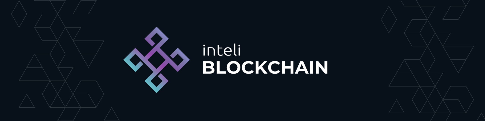

<p align="center">
    
</p>

# Guia de Estudo: Fundamentos da Tokenização

Este material foi desenvolvido para os membros do Inteli Blockchain como um documento de referência e consulta contínua. O objetivo é fornecer uma base teórica e técnica sólida sobre o processo de tokenização, seus diferentes padrões e suas aplicações práticas. Utilize este guia para aprofundar seus conhecimentos, revisar o conteúdo e embasar seus estudos sobre o funcionamento e a emissão de ativos digitais.

Antes de ler o material, recomenda-se a leitura do dicionário de palavras tecnicas no [dicionário](./dicionario.md) para facilitar o entendimento do conteúdo.

---

## 1. Introdução à Web3 e Contratos Inteligentes

Para compreender a tokenização, é fundamental estabelecer a base tecnológica sobre a qual ela opera: a Web3 e os Contratos Inteligentes.

### O que é a Web3?

A Web3 representa a evolução descentralizada da internet. Enquanto na internet tradicional (Web2) as plataformas e os dados são controlados por entidades centrais, a Web3 utiliza a tecnologia blockchain para devolver aos usuários a propriedade e o controle sobre seus ativos digitais. O seu princípio fundamental é a substituição da confiança em intermediários (como bancos e corporações) por redes descentralizadas e código auditável.

### O que são Smart Contracts (Contratos Inteligentes)?

Os Smart Contracts são o motor que faz a Web3 funcionar. Eles são, essencialmente, programas de computador armazenados em uma blockchain que executam ações automaticamente quando condições pré-determinadas são atendidas.

Como não podem ser alterados após sua publicação (imutabilidade) e operam de forma autônoma, eles eliminam a necessidade de terceiros para validar transações ou acordos.

**A analogia da máquina de venda automática:**
A forma mais simples de entender um Smart Contract é pensar em uma máquina de venda de bebidas. Você insere o valor e seleciona o produto desejado. A própria máquina valida a quantia e entrega a bebida. Não há necessidade de um atendente no balcão para aprovar a troca. Na Web3, os Smart Contracts fazem esse mesmo processo de validação e entrega, mas lidando com valores e ativos digitais de forma global e inviolável.

---

## 2. Tokenização e Padrões de Tokens

### O que é Tokenização?

Tokenização é o processo de transformar direitos sobre um ativo, seja ele físico ou digital, em um formato digital (o token) que pode ser emitido, movido, armazenado e registrado em uma blockchain. Este processo permite que ativos tradicionais e nativos digitais sejam integrados ao ecossistema da Web3, beneficiando-se da segurança, automação e transparência dos contratos inteligentes.

### Classificação dos Tokens

Na estruturação de projetos na blockchain, os tokens são divididos em duas categorias principais com base em suas propriedades de troca:

- **Tokens Fungíveis:** São unidades idênticas e perfeitamente intercambiáveis entre si. Um token fungível possui exatamente o mesmo valor e as mesmas características que qualquer outro token da mesma emissão. Assim como moedas fiduciárias tradicionais, onde uma nota de um determinado valor pode ser trocada por outra igual sem distinção para as partes envolvidas, os tokens fungíveis são utilizados na Web3 para representar moedas de ecossistemas, ativos financeiros fracionados ou unidades de valor contínuo.

- **Tokens Não-Fungíveis (NFTs):** São representações digitais únicas e indivisíveis. Cada NFT possui um identificador criptográfico exclusivo e metadados que o distinguem de qualquer outro token, garantindo sua singularidade e servindo como prova definitiva de propriedade. São utilizados para representar bens singulares, como obras de arte, credenciais acadêmicas, registros de propriedades físicas ou itens exclusivos.

### Padrões de Tokens e o ERC-20

Para que diferentes carteiras digitais, corretoras e aplicações descentralizadas (dApps) consigam interagir com milhares de tokens diferentes de forma fluida, o mercado estabeleceu padrões de desenvolvimento. Esses padrões garantem a interoperabilidade técnica entre diferentes sistemas, evitando que cada aplicação precise ser reprogramada para reconhecer um novo token.

O **ERC-20** é o padrão técnico mais consolidado e amplamente utilizado para a criação de tokens fungíveis, originário da rede Ethereum. Ele estabelece um conjunto fixo de regras e funções obrigatórias que um contrato inteligente deve implementar, como verificar o suprimento total de tokens, consultar o saldo de um endereço e executar transferências entre contas. Ao adotar o padrão ERC-20, o desenvolvedor assegura que o token emitido será universalmente compreendido e suportado por toda a infraestrutura compatível do ecossistema Web3, garantindo integração imediata com o mercado.

---

## 3. Aplicabilidade: Por que tokenizar?

A adoção da tokenização transcende a inovação tecnológica, resolvendo ineficiências estruturais dos mercados tradicionais. A conversão de direitos de propriedade e utilidades em tokens digitais oferece vantagens fundamentais na economia e na estruturação de novos modelos de negócio:

- **Liquidez Global e Contínua (24/7):** Diferente dos mercados financeiros e imobiliários tradicionais, que operam com horários de fechamento e restrições geográficas, os tokens podem ser negociados ininterruptamente em escala global e liquidados quase instantaneamente em carteiras digitais.
- **Fracionamento de Ativos:** A tokenização permite a divisão de bens de alto valor em milhares ou milhões de frações menores. Isso democratiza o acesso ao investimento, permitindo que múltiplos indivíduos detenham participações em um ativo que, de outra forma, exigiria um capital inicial inacessível.
- **Transparência e Imutabilidade:** O registro de todas as transações e do histórico de propriedade é mantido publicamente na blockchain. Isso garante a integridade dos dados e reduz significativamente o risco de fraudes e custos de auditoria, uma vez que o registro histórico não pode ser alterado ou corrompido unilateralmente.
- **Automação e Eficiência:** Através da integração com Contratos Inteligentes, processos operacionais inteiros — como a distribuição de lucros, royalties ou a transferência de titularidade — podem ser automatizados. A eliminação de intermediários tradicionais resulta em transações mais rápidas e com taxas reduzidas.

---

## 4. Implementação Prática: Criando o seu Primeiro Token

Nesta seção, vamos tirar a teoria do papel e criar um contrato inteligente real que emite um token padrão ERC-20. O objetivo é que você entenda não apenas como executar o código, mas a lógica por trás de cada linha.

### A Ferramenta: Remix IDE

Para programar na Web3 sem precisar instalar ambientes complexos no seu computador, utilizamos o Remix. Ele é um editor de código que roda direto no navegador e já possui uma blockchain simulada para testarmos tudo de forma gratuita e instantânea.

### Passo 1: Preparando o Ambiente

1. Abra o seu navegador e acesse: **remix.ethereum.org**.
2. Na barra lateral esquerda, clique no ícone de "File Explorer" (geralmente o primeiro ícone no topo).
3. Dentro da pasta "contracts", crie um novo arquivo clicando no ícone de uma folha em branco.
4. Nomeie este arquivo como `MeuToken.sol` (a extensão `.sol` avisa ao sistema que vamos escrever em Solidity).

### Passo 2: Escrevendo o Contrato Inteligente

Copie o bloco de código abaixo e cole no seu arquivo `MeuToken.sol`. Nós utilizaremos um código fornecido pela OpenZeppelin, que é a biblioteca padrão e mais segura do mercado para contratos inteligentes.

```solidity
// SPDX-License-Identifier: MIT
pragma solidity ^0.8.20;

import "@openzeppelin/contracts/token/ERC20/ERC20.sol";

contract TokenDeEstudo is ERC20 {

    constructor() ERC20("Token de Estudo", "TKE") {
        _mint(msg.sender, 1000 * 10 ** decimals());
    }
}

```

### Passo 3: Entendendo o Código Linha por Linha

É crucial entender o que o código está fazendo antes de executá-lo. Aqui está a tradução da lógica:

- **`// SPDX-License-Identifier: MIT`**: É um comentário obrigatório que define a licença de uso do código. A licença MIT significa que o código é aberto e livre para uso.
- **`pragma solidity ^0.8.20;`**: Esta linha diz ao Remix qual versão da linguagem Solidity ele deve usar para ler o nosso código.
- **`import "...";`**: Em vez de escrever toda a lógica matemática de um token do zero (o que seria perigoso e suscetível a falhas), nós importamos um "molde" pronto, seguro e testado pelo mercado: o contrato `ERC20` da biblioteca OpenZeppelin.
- **`contract TokenDeEstudo is ERC20`**: Aqui nós criamos o nosso programa. O nome dele é `TokenDeEstudo`. A palavra `is` (é) significa que ele herda todas as regras e funções do molde `ERC20` que acabamos de importar.
- **`constructor() ERC20(...)`**: O construtor é uma função especial. Ele roda apenas uma única vez na vida do contrato: no momento exato em que ele é publicado na blockchain. Dentro dos parênteses, passamos o nome oficial do nosso token ("Token de Estudo") e a sua sigla ("TKE").
- **`_mint(...)`**: Mintar significa "cunhar" ou "emitir" moedas. Esta função cria os tokens do nada.
- **`msg.sender`**: É uma variável global do Solidity. Ela descobre automaticamente qual é a carteira que apertou o botão de publicar o contrato. Ou seja, os tokens serão enviados para você.
- **`1000 * 10  decimals()`**: Nós queremos emitir 1.000 tokens. Porém, a blockchain não entende números com vírgula. A função `decimals()` adiciona 18 zeros após o número 1.000, garantindo a precisão matemática da rede Ethereum.

### Passo 4: Compilando o Código

Compilar é o processo de traduzir o texto que nós escrevemos para a linguagem de máquina que a blockchain entende.

1. No menu lateral esquerdo, clique no ícone **Solidity Compiler** (tem o formato de um "S").
2. Certifique-se de que o compilador selecionado no topo está na versão `0.8.20` ou superior.
3. Clique no botão azul **Compile MeuToken.sol**. Se aparecer um sinal de confirmação verde, seu código não tem erros.

### Passo 5: Fazendo o Deploy (Publicando)

Fazer o deploy significa enviar o seu contrato para viver na blockchain.

1. No menu lateral esquerdo, clique no ícone **Deploy & Run Transactions** (logo abaixo do compilador).
2. Na opção "Environment" (Ambiente), deixe selecionado **Remix VM**. Esta é a blockchain falsa e gratuita que o Remix cria no seu navegador.
3. Mais abaixo, clique no botão laranja **Deploy**.

### Passo 6: Interagindo com o seu Token

Se o deploy funcionou, seu contrato aparecerá no canto inferior esquerdo, na aba **Deployed Contracts**. Clique na seta para expandir as opções e interagir com seu dApp:

- Clique no botão azul **`name`**. O sistema deve retornar "Token de Estudo".
- Clique no botão azul **`symbol`**. O sistema deve retornar "TKE".
- Clique no botão azul **`totalSupply`**. O sistema mostrará a quantia enorme gerada (1000 seguido de 18 zeros).
- **Para ver o seu saldo:** Vá até o topo da tela, no campo "Account", e copie o endereço da sua carteira clicando no ícone de copiar. Volte para as funções do contrato, cole o seu endereço no campo ao lado do botão **`balanceOf`** e clique nele. Você verá que possui a totalidade dos tokens emitidos.

---

## 5. Aplicações Avançadas: RWA e DAOs

Com a base técnica de criação de tokens consolidada, o próximo passo lógico é entender como essa tecnologia interage com o mundo físico e com a governança corporativa. Estas duas frentes representam o futuro do mercado e serão o foco de outros materiais.

### Real World Assets (RWA)

RWA (Ativos do Mundo Real) é a vertente da Web3 focada em tokenizar bens físicos, como imóveis, commodities, títulos do governo e veículos de alto padrão. O objetivo é trazer a liquidez e o fracionamento da blockchain para mercados tradicionais que costumam ser lentos e burocráticos.

A implementação de um RWA vai além do código: exige uma forte estruturação jurídica para garantir que o token digital tenha validade legal e econômica sobre o bem físico correspondente.

### Decentralized Autonomous Organizations (DAOs)

Uma DAO é uma organização corporativa sem um controle central. Diferente de uma empresa tradicional com um CEO e um conselho de administração, uma DAO é regida por regras escritas diretamente em contratos inteligentes.

Nesse modelo, a governança é distribuída. Quem possui o token da organização tem direito a voto nas decisões do projeto. Além disso, o caixa financeiro (a tesouraria) é gerenciado pelo próprio código, que só libera fundos ou aprova despesas se a maioria dos membros validar a transação na blockchain.
